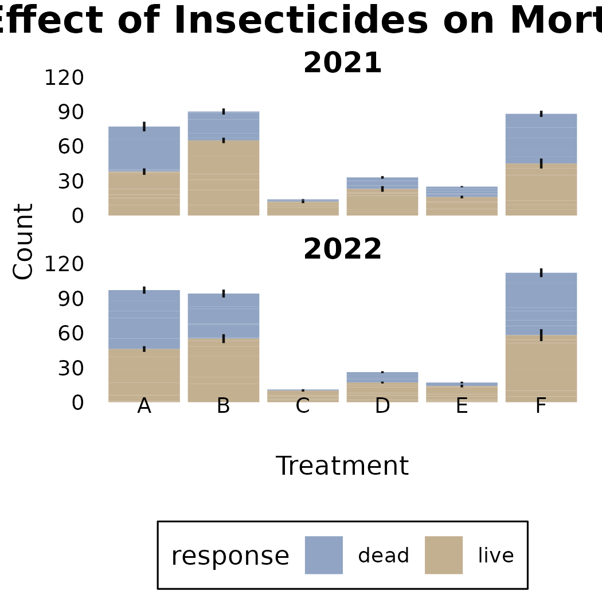
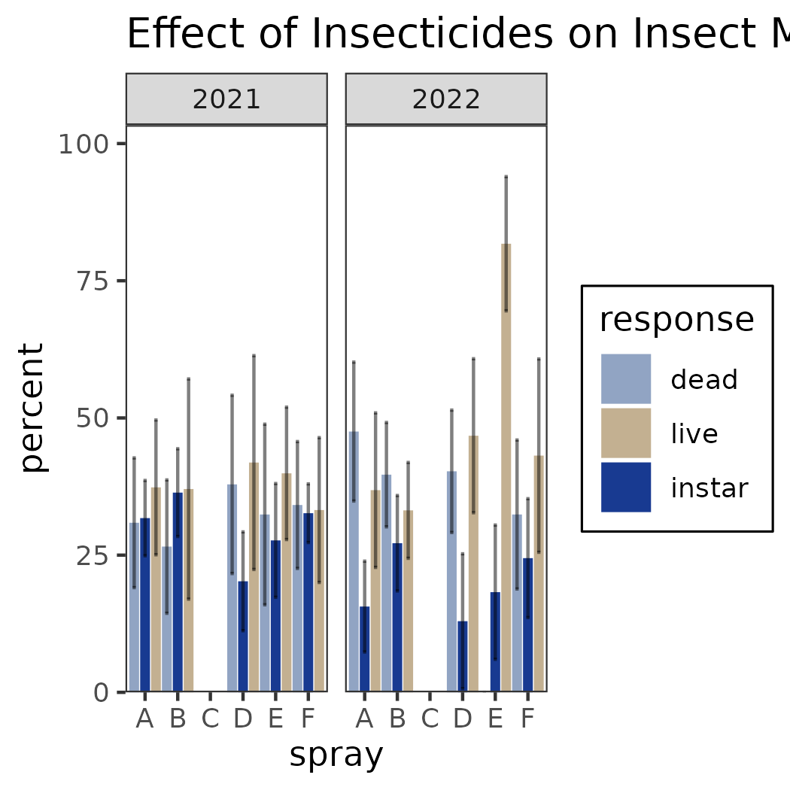
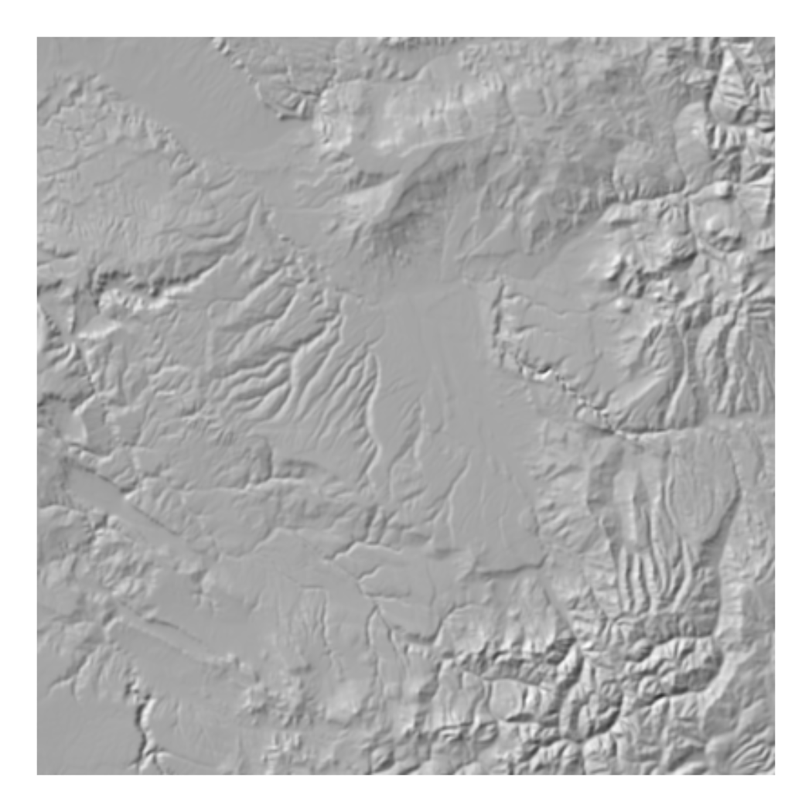
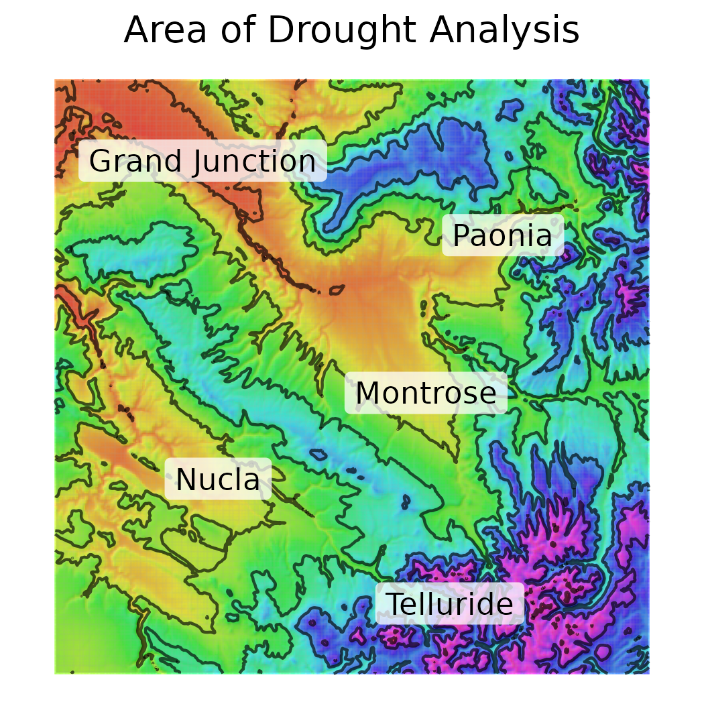

# UFO-elements-of-style

Design elements for a consistent 5 year AIM report. We define palettes, ggplot themes, and write some function to automate plot creation for us. 

## Color Palettes

### Public Land Ownership

top L to bottom R:  
'BLM', 'USFS', 'NPS', 'FWS',  
'USBR', 'TRIB', 'DOD', 'OTHF',  
'SLB', 'PVT', 'CITY_CNTY_SDC_SDNR_SPR'  

Public Land Ownership, Thanks to the great "atMan", Dave S.,
H-1553-Publications Standards Manual Handbook

### Stratum

top L to bottom R:  
'PJ', 'SS', 'SD', 'MMS', 'AS',  
'RI', 'OT', 'GR', 'PP', 'MC'  

Thanks to M. Bach & M. Marsich

### Lifeform

top L to bottom R:  
'Annual Grass', 'Perennial Grass', 'Annual Forb',  
'Perennial Forb', 'Tree', 'Shrub',  
'Succulent'  

Thanks to M. Bach & M. Marsich

## Plots and Themes

### Stacked Prop Drawer

This plot utilizes the base theme 'theme_prop_bar'. It is used to display three components:
- A binomial response (e.g. Yes/No)  
- The total number of samples (useful for unequal sample sizes)  
- confidence estimates associated with the proportion of the binomial responses  

### Dodged Drawer

This plot is very similar to the stacked prop drawer. It is used to display three components:
- A response with => categorical outcomes
- A breakdown of the percent responses for each outcomes (useful for equal sample sizes)
- confidence estimates associated with the percentages of outcomes

## Basemaps

### Example Hillshade 

This hillshade serves as a basemap for multiple cartographic products. It may be drawn upon by utilizing the transperancy (alpha) parameter of objects drawn on top of it. 

### Example topographic on hillshade

This is an example of putting topographic information on top of a hillshade. Notice how the information from the above hillshade is contextualized by the long light blue spur in the center of the map.
