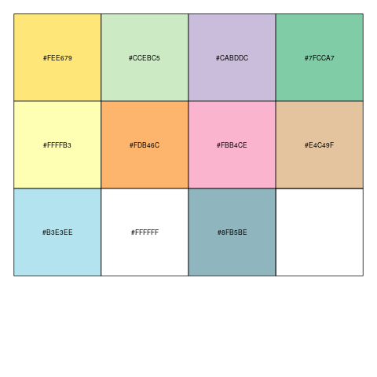
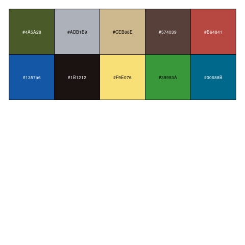
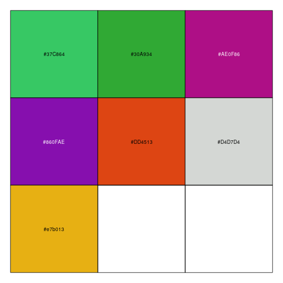

# UFO-elements-of-style

Design elements for a consistent 5 year AIM report. We define palettes, ggplot themes, and write some function to automate plot creation for us. 

## Color Palettes:

top L to bottom R:  
'BLM', 'USFS', 'NPS', 'FWS',  
'USBR', 'TRIB', 'DOD', 'OTHF',  
'SLB', 'PVT', 'CITY_CNTY_SDC_SDNR_SPR'  

Public Land Ownership, Thanks to the great "atMan", Dave S.,
H-1553-Publications Standards Manual Handbook

top L to bottom R:  
'PJ', 'SS', 'SD', 'MMS', 'AS',  
'RI', 'OT', 'GR', 'PP', 'MC'  

Thanks to M. Bach, and M. Marsich

top L to bottom R:  
'Annual Grass', 'Perennial Grass', 'Annual Forb',  
'Perennial Forb', 'Tree', 'Shrub',  
'Succulent'  

Thanks to M. Bach, and M. Marsich
